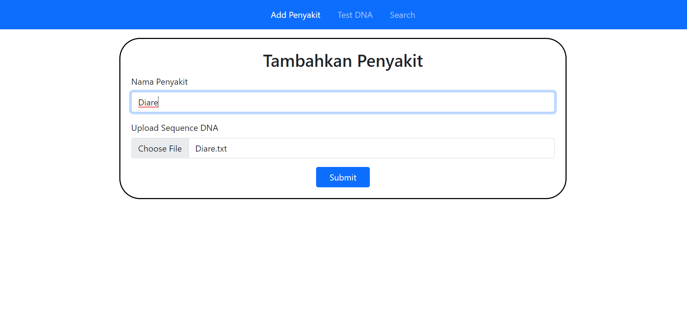
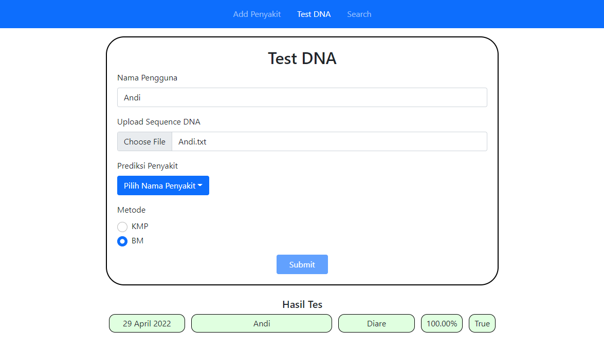
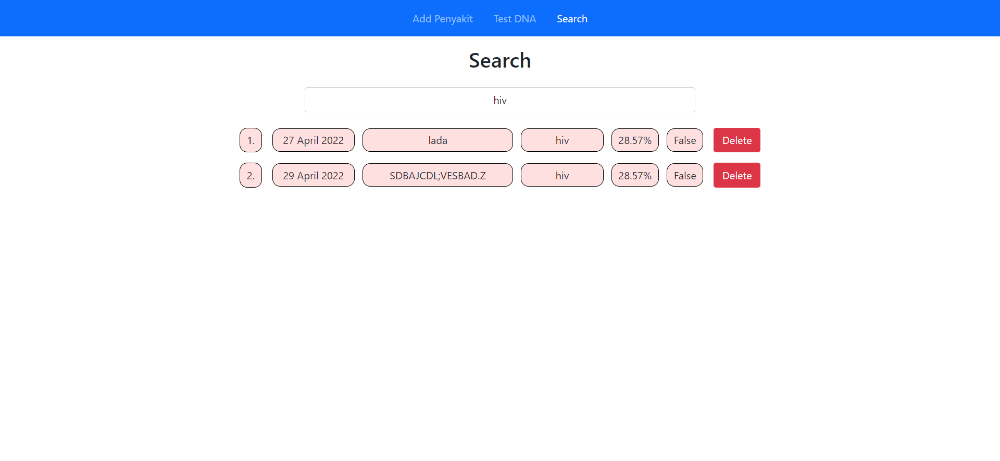

# Application of String Matching and Regular Expression in DNA Pattern Matching

> Program ini ditujukan untuk memenuhi Tugas Besar Strategi Algoritma IF2211 tahun ajaran 2021/2022

> Aplikasi web yang dibangun adalah aplikasi yang memiliki beberapa fitur. Aplikasi ini dapat melakukan penambahan penyakit berdasarkan nama dan file sequence DNA penyakit tersebut. Penyakit-penyakit yang telah ditambahkan dapat dites terhadap sequence DNA dari pengguna dengan cara menggunggah nama pengguna, file sequence DNA, memilih penyakit dan memilih metode pengetesan. Hasilnya akan langsung ditampilkan apakah DNA pengguna memiliki kemiripan dengan DNA penyakit. Hasil-hasil pengetesan yang telah dilakukan dapat dilakukan pencarian berdasarkan query pengguna menggunakan regular expression.

> Aplikasi ini memiliki berbagai manfaat. Dengan memiliki sequence DNA dari penyakit dan pengguna, kita dapat melakukan pengetesan seberapa beresiko pengguna mendapatkan penyakit yang dites. Hal ini akan membantu para pengguna untuk mendapatkan informasi lebih awal sebelum mendapatkan penyakit tersebut, ataupun penyakit menjadi parah. Informasi tersebut dapat digunakan untuk melakukan langkah-langkah medis preventif dari awal.


## Fitur Aplikasi
- Menambahkan data DNA ke database
- Melakukan pengetesan DNA pengguna dengan penyakit
- Menampilkan persentase kemiripan DNA pengguna dengan DNA penyakit
- Menampilkan riwayat pengetesan penyakit
- Melakukan filter riwayat pengetesan penyakit

## Setup Program
- Pastikan di komputer Anda telah terinstall bahasa Go, Node JS, dan MySQL

## Cara Menjalankan Program
- Setup database
    - Jalankan command berikut pada MySQL server anda untuk membuat database, user dan memberikan priviledge
      ```sql
      CREATE DATABASE tubes3stima;
      CREATE USER 'stima'@'127.0.0.1' IDENTIFIED BY 'fFDzwk4Z!FpU_QU';
      GRANT ALL PRIVILEGES ON tubes3stima.* TO 'stima'@'127.0.0.1' WITH GRANT OPTION;
      ```
- Cara menjalankan Backend program:
    - Pindah ke directory backend
      ```
      cd src/backend
      ```
    - Jalankan program
      ```
      go run server.go
      ```
- Cara menjalankan Frontend program:
    - Pindah ke directory frontend
      ```
      cd src/frontend
      ```
    - Install semua dependencies:
      ```sh
      npm install
      yarn install    # bila anda memiliki yarn
      ```
    - Jalankan program
      ```sh
      npm run dev
      yarn dev        # bila anda memiliki yarn
      ```

## Tampilan Program
- Halaman Tambah Penyakit



- Halaman Test DNA



- Halaman Pencarian



## Developer
- 13520039	Rozan Fadhil Al Hafidz
- 13520103	Amar Fadil	
- 13520105	Malik Akbar Hashemi Rafsanjani
